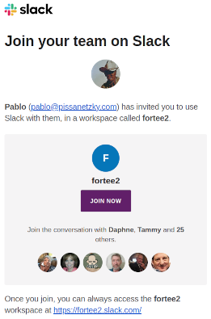
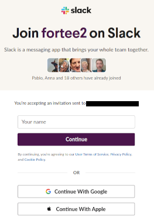
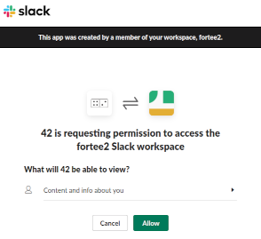
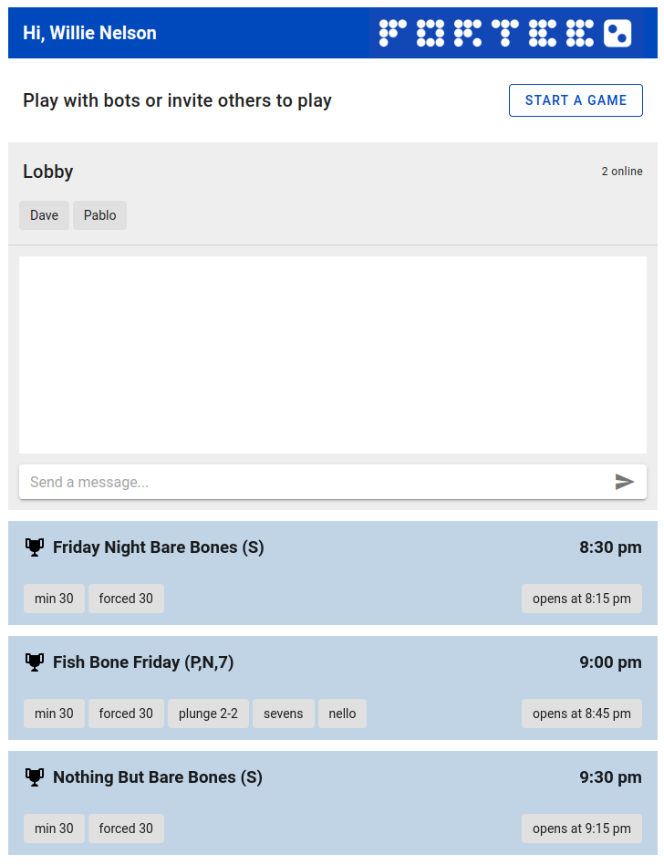
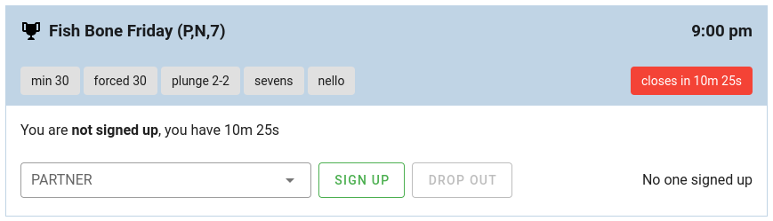

# fortee2

[fortee2](https://fortee2.com) is a website that lets anyone play 42 online, for free.

## Getting in

For now, fortee2 is **invite-only** and the invitations are handled through **Slack**. To get an invitation to play, ask one of your friendly 42-online TDs and give them your e-mail address.

When your invitation is processed, you will receive an **e-mail from Slack** that looks like this:

When you receive it, click on **JOIN NOW**, which will open up your browser to a page that looks like this:

Fill in your name, and hit **Continue**. This should take you to our **Slack "workspace"**, where you can meet everyone else that has been invited. You will automatically join a "channel" called **#general** full of friendly people that are more than willing to help. Just say hello!

If you lose your way, simply follow [this link](https://fortee2.slack.com) to open up Slack in your browser.

### Tablets and phones

If you try to do this on a tablet or a phone, you may be prompted to install the Slack app.

**DON'T INSTALL THE SLACK APP** - just open up Slack in your browser.

If you lose your way, simply follow [this link](https://fortee2.slack.com).

## The website

Slack is just a means to create an account and get help. To play games and signup for tournaments, you have to go to the [fortee2 website](https://fortee2.com). Once there, hit the **PLAY** button.

The first time you do this, you will be taken to a page that looks like this:

This just means that the website is asking for your permission to log in with your new Slack account. Just click **Allow** to be taken to the main page.

## Get to know the website

You are finally here!

The website is divided into three main areas

## The play section

At the top is a horizontal bar that normally says "Play with bots or invite others to play" with a big **START A GAME** button. This is why you're here after all, so go ahead!

This button will open up a window that lets you invite other folks to play and set the rules for the game, but **nothing is required**: you can just hit the **PLAY** button to start a new game with bots and the default rules.

Once you do that, a new tab will open with the **play page**, which is really easy to navigate. You'll be bidding 2 marks in no time.

Note that when you start a game, this section of the page will change, allowing you to close the game. It can take on **three different shapes**:

* If you started a game with bots or other people, you will have a button to **CLOSE** the game. If you close it the game is over and, if you invited others, their invitation will disappear.

* If someone else invited you to play a game, you will have the options to **PLAY** or **DECLINE** the invitation. If you decline, the game will end for everyone and the invitation will disappear for everyone.

* If you signed up for a tournament and your next game is ready, this section will give you the option to **PLAY** at that table.

## The lobby

This is just a simple chat box that lets you message everyone else that is on the website **at the same time**. Above the chat box, you will see a list of names - all the folks that are online right now. You can type a message and hit **enter** or the paper plane button. Remember to be nice!

## The tournament list

Below the lobby, there's a **list of upcoming and recent tournaments**. This list is limited to just the next few in order to keep it simple. It updates in real time as things happen - new tournaments will show up and old ones will vanish automatically. There's no need to refresh the page.

You can see the name of each one, the rules, the start time and an indication about its status.

### A tournament opens

When a tournament **opens for sign up**, the area below it will change. You will see buttons to sign up and drop out and a timer will show you how long you have left to sign up. If the tournament allows you to pick a partner, you'll have a drop-down to choose someone:

There's also a counter showing you how many people have signed up. Tournaments need at least 8 people, or 4 teams to run. If not enough people sign up, the tournament will be **canceled** and will stay in the list for about 10 minutes.

### A tournament starts

After signup closes and if enough people signed up, the tournament will start. The area below it will change again. Several things can happen:

* If an odd number of people signed up, one person will be **randomly dropped**. If it is you, you'll be notified here. It happens to everyone...

* If you **draw a bye** in the first round of the tournament, it means you're not playing yet. You'll be notified here and you'll just have to wait until the first round is over and your first game is ready to start. _There's no way to monitor the running tournament yet, but that's an upcoming feature_.

* When your first game is ready to start, you'll see **a button to join the table**. Clicking this button will open up a new tab with the **play** page. Here, you will see the names of the other three players as well as yours. If spinners are showing for the other players, it means **they have not joined the table yet**. Be patient and stay there, with the tab open until they do. If you want to give them a heads up, keep the tab open and switch to the tab with the **chat box** and holler at them.

* If you lose, the tournament is over for you. You'll be notified.

* If you win, you will advance and you can safely close the tab with the **play** page for the game you finished. Go back to the main page - you'll be notified when your next game is ready and you can win again.

* When the **tournament is over**, the winners (_aka you and your partner_) will be announced here. It's time to sign up for the next one...

## Help!

If you have any questions, don't be afraid to ask someone for help. Good luck!

