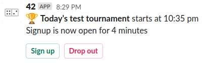
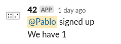

# Tournaments

This document explains how tournaments work with Slack and fortee2.

## Signup opens

As soon as signup opens for a tournament, a new message will be posted in the `#general` channel that looks like this:

This message is called the **tournament thread** and will stick around and change as more things happen during the life of the tournament.

## Signup and drop out

As you can see, the message has both `Sign up` and `Drop out` buttons. If the tournament lets you **choose your partner**, there will also be a box to enter your partner.

If you click the `Sign up` button and everything goes smoothly, two things will happen:

1. You will get a message telling you that you are signed up
2. Another message will be posted in the **tournament thread** telling everyone that you signed up and how many total people have signed up.

That message looks like this:

If there is a problem, you will get only a private message telling you what it is.

If you click `Drop out`, it'll be about the same: one message to you and another to the **tournament thread** letting everyone know.

## Sign up closed

Once sign up closes, the **tournament thread** message will change to let you know. The `Sign up` and `Drop out` buttons will disappear.

## Canceled

If there are not enough teams signed up, the tournament will be canceled and the **tournament thread** message will change again, with a sad, sad note: the tournament is over before it started.

## Start!

If there are enough teams, the tournament will start and the **tournament thread** message will change to reflect it.

If you have a **bye** for the round, a new message will be posted in the **tournament thread** mentioning you and telling you to sit tight.

If you don't have a bye, you will be invited to your first game. Slack will create a **new conversation** between the '42' app and all four players at the table. In that conversation, there will be a message with a button to `Play` the game, just like when you start a single game.

When you click the `Play` button, you will be taken to the game screen in your browser and you'll play that game (and win, of course).

## Game over

When you finish the game, you can close the browser tab and **go back to Slack**. The conversation that was started for this game will update with a message about the winners and, a **new one will be created for the next game**. Join that one, and you will see a new message with a `Play` button for the next game. This goes on until the tournament is over.

## Tournament over

The original **tournament thread** message will now update showing the winners and we're done...ready for the next tourney.

